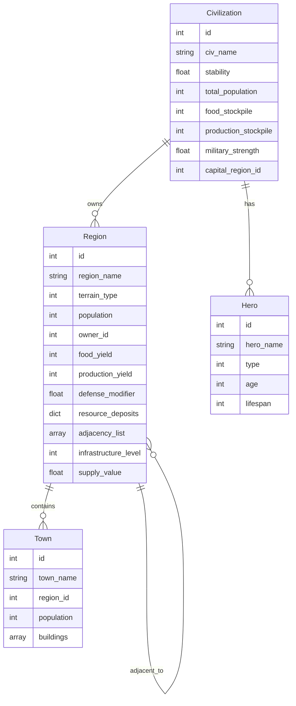

# Core Data Schema (Aligned)

## Region

```gdscript
class_name RegionData
extends Resource

@export var id: int
@export var region_name: String
@export var terrain_type: Enums.TerrainType
@export var population: int
@export var owner_id: int                 # -1 = neutral
@export var food_yield: int
@export var production_yield: int
@export var defense_modifier: float
@export var resource_stock: Dictionary    # legacy placeholder
@export var resource_deposits: Dictionary # {resource_type_int: remaining_quantity}
@export var extraction_years: int
@export var adjacency_list: Array[int]
@export var infrastructure_level: int     # 0-5
@export var size_factor: float
@export var development_tier: int
@export var demotion_years: int
@export var urbanization_level: float
@export var town_count: int
@export var supply_value: float           # 0.0 - 1.0
@export var towns: Array                  # Array[TownData]
```

## Civilization

```gdscript
class_name CivilizationData
extends Resource

@export var id: int
@export var civ_name: String
@export var color: Color
@export var stability: float              # 0-100
@export var total_population: int
@export var food_stockpile: int
@export var production_stockpile: int
@export var military_strength: float
@export var capital_region_id: int
@export var hero_ids: Array[int]
@export var is_collapsed: bool
@export var is_player: bool
@export var governance_tier: Enums.GovernanceTier
@export var governance_years: int
@export var current_era: Enums.Epoch

# Golden age
@export var golden_age_years_remaining: int
@export var golden_age_cooldown: int

# Hidden tech metrics
@export var knowledge: float
@export var energy: float
@export var social_coordination: float
@export var economic_surplus: float
@export var military_pressure: float

# AI personality
@export var expansion_bias: float
@export var aggression_bias: float
@export var diplomacy_bias: float
@export var economy_bias: float

# War & diplomacy
@export var war_targets: Array[int]
@export var war_durations: Dictionary     # {civ_id: years_at_war}
@export var peace_cooldowns: Dictionary   # {civ_id: years_remaining}
@export var alliance_partners: Array[int]
@export var consecutive_low_stability_years: int

# Tech + resources
@export var technologies: Array[String]
@export var resource_stockpiles: Dictionary
@export var resource_production_log: Dictionary
```

## Hero

```gdscript
class_name HeroData
extends Resource

@export var id: int
@export var hero_name: String
@export var type: Enums.HeroType
@export var age: int
@export var lifespan: int
@export var owner_civ_id: int
@export var birth_year: int
```

## Town

```gdscript
class_name TownData
extends Resource

@export var id: int
@export var town_name: String
@export var region_id: int
@export var population: int
@export var buildings: Array[Dictionary]  # [{type: BuildingType, count: int}]
@export var infrastructure_level: int
@export var founded_year: int
@export var workforce_preset: int
```

## Entity Relationship Diagram


