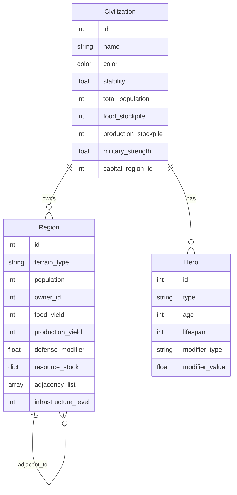

# Core Data Schema

## Region

```gdscript
class_name RegionData
extends Resource

@export var id: int
@export var terrain_type: String          # "river_basin", "plains", "mountains", etc.
@export var population: int
@export var owner_id: int                 # -1 = neutral
@export var food_yield: int
@export var production_yield: int
@export var defense_modifier: float       # 0.7 - 1.4
@export var resource_stock: Dictionary    # {"coal": 100, "oil": 50}
@export var adjacency_list: Array[int]    # neighboring region IDs
@export var infrastructure_level: int     # 0-5
```

## Civilization

```gdscript
class_name CivilizationData
extends Resource

@export var id: int
@export var name: String
@export var color: Color
@export var stability: float              # 0-100
@export var total_population: int
@export var food_stockpile: int
@export var production_stockpile: int
@export var military_strength: float
@export var capital_region_id: int
@export var hero_list: Array[int]         # hero IDs
@export var is_at_war: bool
@export var golden_age_years_remaining: int
@export var golden_age_cooldown: int

# Hidden tech metrics
@export var knowledge: float              # 0-100
@export var energy: float                 # 0-100
@export var social_coordination: float    # 0-100
@export var economic_surplus: float       # 0-100
@export var military_pressure: float      # 0-100

# AI personality
@export var expansion_bias: float         # 0.0-1.0
@export var aggression_bias: float        # 0.0-1.0
@export var diplomacy_bias: float         # 0.0-1.0
```

## Hero

```gdscript
class_name HeroData
extends Resource

@export var id: int
@export var type: String                  # "general", "reformer", "visionary"
@export var age: int
@export var lifespan: int                 # randomized 40-80
@export var modifier_type: String         # "military", "stability", "production"
@export var modifier_value: float         # e.g., 0.10 for +10%
@export var owner_civ_id: int
```

## Army (Future Phase)

```gdscript
class_name ArmyData
extends Resource

@export var manpower: int
@export var morale: float                 # 0.5-1.2
@export var supply_status: float          # 0.5-1.0
@export var doctrine: float               # 0.8-1.2
@export var equipment_quality: float      # 0.5-1.5
@export var owner_civ_id: int
@export var current_region_id: int
```

## Entity Relationship Diagram


